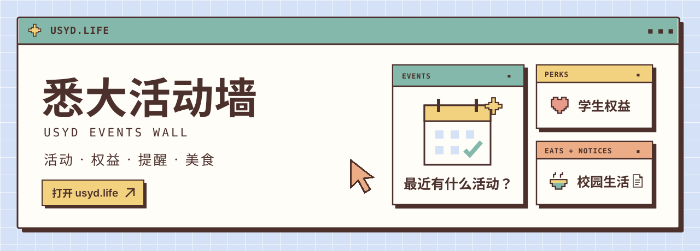

  <a href="https://usyd.life/"><strong>打开网站 ↗</strong></a> ·
  <a href="https://usyd.life/submit.html">分享一条信息</a> ·
  <a href="https://usyd.life/guestbook.html">留言板</a>

**悉大活动墙**是由学生共同维护的悉尼大学校园信息站，收集校园及周边活动、学生权益、生活提醒和美食推荐。想找活动，或发现了值得分享的信息，都可以来这里。

## 可以找到什么

| 板块 | 内容 |
| --- | --- |
| [活动广场](https://usyd.life/events.html) | 校园、社团和悉尼周边活动。按时间、关键词与标签寻找感兴趣的活动，查看地点、费用和报名方式。 |
| [学生权益](https://usyd.life/benefits.html) | 学生优惠、免费资源和校园服务，以及适用条件与领取方式。 |
| [生活提醒](https://usyd.life/notices.html) | 与在悉尼学习、生活有关的日期和实用提醒。 |
| [美食推荐](https://usyd.life/food.html) | 校园及周边吃什么，查看位置、菜品、价格和菜单。 |

首页汇总近期活动与日历，也会随机展示仍在有效期内的权益、提醒和美食。每条内容都有独立详情页，可以分享链接、点赞或参与评论。**活动日期与时间均按悉尼当地时间显示。**

## 一起补充这面墙

不需要写代码，有 GitHub 账号就能投稿：

1. 打开[投稿页面](https://usyd.life/submit.html)，选择活动、权益、提醒或美食，填写信息和来源。
2. 预览后前往 GitHub 提交 Issue。需要配图时，在 Issue 的「配图」栏粘贴或拖入图片；最多 3 张，第一张用作封面。
3. 维护者核对后，内容会自动收录并更新到网站。处理进度和需要补充的信息都会留在原 Issue 中。

也可以直接使用[仓库投稿模板](https://github.com/snowhejia/usyd.life/issues/new/choose)。请写清楚日期、地点、费用和参加条件；美食推荐请注明店名、地址及价格依据，附上可核对的来源。

发现时间改了、优惠过期或店铺信息不对？点击对应详情页的 **「纠错 / 补充」**，就能带着原信息提交更新。

## 评论与留言

每条详情下方都有评论区，可以分享体验、提问或补充信息。点击「写评论」后使用 GitHub 回复，也支持图片。

网站建议和日常交流可以放在[留言板](https://usyd.life/guestbook.html)。投稿、评论和留言都公开保存在 [GitHub Issues](https://github.com/snowhejia/usyd.life/issues)，方便大家查阅历史记录、继续补充。

## 关于

这是学生共建的非官方项目，与悉尼大学及活动主办方无隶属关系。各条目保留信息来源；日期、价格和参加条件请以主办方最新通知为准。

想参与内容整理，可阅读[维护指南](CONTRIBUTING.md)。代码采用 [MIT 许可](LICENSE)；第三方照片、海报和商标归各自权利人所有，详见[资料与图片来源](CREDITS.md)。
